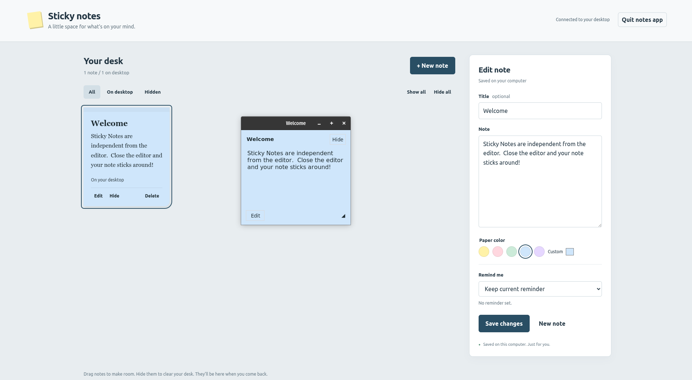

# Sticky Notes for X11



Paper-colored notes that float above your desktop, with a local web editor and optional reminders. Built with Python and Tkinter; no pip packages, account, or internet connection needed.

## Install on a new computer

Requirements: Linux with an X11 display (including an accessible XWayland display), Python 3.10 or newer, Tkinter, and a web browser. There are no pip or npm dependencies and no build step. A Wayland compositor may limit XWayland stacking behavior; this app targets X11.

On Debian/Ubuntu:

```sh
sudo apt update
sudo apt install git python3 python3-tk
git clone https://github.com/hazlema/sticky-notes.git
cd sticky-notes
python3 -m sticky_notes.install
python3 -m sticky_notes --editor
```

On Fedora, install the prerequisites with `sudo dnf install git python3 python3-tkinter`, then use the same clone and launch commands. For a private repository, authenticate to GitHub first (for example `gh auth login`, then `gh repo clone hazlema/sticky-notes`).

The installer creates the application-menu launcher at `~/.local/share/applications/sticky-notes.desktop` (or the corresponding location under `$XDG_DATA_HOME`) and offers to start your notes automatically at login. Answer the prompt, or decide ahead of time in scripts:

```sh
python3 -m sticky_notes.install --autostart     # install the login entry without asking
python3 -m sticky_notes.install --no-autostart  # skip the login entry without asking
```

Both entries point to this checkout and the Python interpreter used for installation. Keep the checkout in a permanent location. If you move it, run the installer again from its new location.

## Open from your application menu

Find **Sticky Notes** in your application menu and pin it to your launcher if you like.

1. Click the Sticky Notes icon to open the web editor.
2. Create or edit your notes; they appear on the desktop.
3. Close the browser tab/window. The notes and timers keep running.
4. Click the icon again to reopen the editor for the same notes.

The Python process remains running because it owns the desktop windows. Reopening the editor reuses that process; it does not create another set of notes or change which notes are hidden. **Quit notes app** is the separate action that closes all note windows and stops timers.

## Run from a terminal

From this directory:

```sh
python3 -m sticky_notes
```

A plain launch restores your saved desktop notes and starts reminders without opening a browser. To create or edit notes, click the installed icon or run `python3 -m sticky_notes --editor`. Closing the browser leaves the notes running.

```sh
python3 -m sticky_notes --editor     # Open or reopen the editor
python3 -m sticky_notes --no-browser # Compatibility alias for a plain launch
python3 -m sticky_notes --port 8766
python3 -m sticky_notes --data-dir /path/to/your/notes
```

The default web address is `127.0.0.1:8765`. Open the **full editor link printed in the terminal**: it includes a random access token that changes each launch. `--port 0` chooses an available port. Launching again with the same data directory reuses the existing instance. Pass `--editor` to open its editor; without it, the command prints the editor link and exits without opening a browser. `--editor` and `--no-browser` cannot be combined. The installed shortcut includes `--editor`.

## Using your notes

- **Move:** drag a note's title bar or its colored header.
- **Resize:** drag its window borders or the bottom-right corner grip.
- **Edit:** click Edit on the desktop note or its card in the browser.
- **Hide:** click Hide. Its contents stay saved. Closing a note's window asks you to choose **Hide**, **Delete**, or **Cancel**.
- **Show:** use Show on a hidden note in the editor, or Show all.
- **Color:** select a pastel or use Custom for any background color. Text automatically switches between dark and light for readability.
- **Delete:** click Delete beside Edit on a desktop note, or delete it in the editor; confirmation is required. Choosing Delete in the close dialog also permanently removes the note.
- **Quit:** use Quit notes app in the editor or press Ctrl+C in the launching terminal. Closing a desktop note only hides that note.

The operating system's window manager honors the always-on-top request. Notes remain normal resizable windows so window-manager controls and keyboard navigation work. Closing the browser does not stop the app.

## Reminders

Select **Set a timer…**, choose **Hours** (0–24) and **Minutes** (0–60), and save. Both dropdowns start at 0; choose a total of at least 1 minute. For example, 1 hour and 30 minutes sets a 90-minute timer. Minutes can be 60, so 24 hours plus 60 minutes is a 25-hour timer. When the timer expires, the app shows and raises the note, highlights it, and requests a system bell. Use Dismiss or Snooze 5 min on the note, or the corresponding controls in the editor. Pending timers can be cancelled in the editor.

The system bell may be silent depending on your desktop/audio settings. Raising a note does not deliberately move keyboard focus. Timers work while the app is running; they do not launch a stopped app or wake a suspended computer. A missed reminder fires when you next start the app. An already active alert stays active across restarts without repeatedly beeping. Hiding an active alert keeps it hidden until you show it or a snoozed reminder comes due.

## Start notes automatically at login

The installer manages login startup: it asks `Start notes automatically at login? [Y/n]` and creates `~/.config/autostart/sticky-notes.desktop` (or the corresponding location under `$XDG_CONFIG_HOME`) when you accept. At login the entry runs `python3 -m sticky_notes` without `--editor`, quietly restoring visible notes and resuming timers without opening a browser. Hidden notes stay hidden unless a reminder comes due. Your application-menu shortcut still includes `--editor`, so clicking the icon opens the editor.

To enable login startup later, rerun `python3 -m sticky_notes.install --autostart`. To disable it, delete the autostart file (`--uninstall` also removes it):

```sh
rm "${XDG_CONFIG_HOME:-$HOME/.config}/autostart/sticky-notes.desktop"
```

Avoid adding a hand-written command in your desktop's Startup Applications dialog: desktop `Exec` lines are not shell commands, so `cd` and `;` fail silently there. The installer writes the entry with the correct working directory instead.

After updating from an older version, quit the running app once and rerun `python3 -m sticky_notes.install` so your shortcuts pick up the current options.

## Saved data

Notes, background colors, visibility, reminder state, and window geometry are saved in:

```text
$XDG_DATA_HOME/sticky-notes/notes.json
```

If `XDG_DATA_HOME` is unset, the default is `~/.local/share/sticky-notes/notes.json`. Changes save automatically; moving/resizing saves after a short debounce. Back up this file while the app is stopped. Invalid data is reported and preserved rather than overwritten. A failed save reports an error and preserves the last saved note state.

The web server binds only to the local loopback address, checks the request host and origin, and requires its per-launch token for API access. No note data is sent to external services. Treat the editor link as private to your local session.

## Back up and restore your notes

**Cloning this repository restores the app, not your personal notes.** Back up `notes.json` separately before reinstalling your operating system. Stop the app with **Quit notes app** first so its last changes are saved.

With the default data location:

```sh
# Copy this backup to a drive or another location that survives reinstalling.
cp "${XDG_DATA_HOME:-$HOME/.local/share}/sticky-notes/notes.json" ./sticky-notes-backup.json
```

After reinstalling and cloning the app, restore the file while the app is stopped:

```sh
mkdir -p "${XDG_DATA_HOME:-$HOME/.local/share}/sticky-notes"
cp ./sticky-notes-backup.json "${XDG_DATA_HOME:-$HOME/.local/share}/sticky-notes/notes.json"
python3 -m sticky_notes
```

Restoring replaces the current notes, so back up an existing file first if it contains anything you need. If you use `--data-dir`, back up and restore `notes.json` in that directory instead. Do not restore `.lock` or `session.json`; these are runtime files and are recreated automatically. Personal notes, backups, and session files are excluded from Git.

## Update

Stop the running app before updating so the old code is not still holding your notes: use **Quit notes app** in the editor (this saves its last changes), or press Ctrl+C in the terminal that launched it. Confirm nothing is still running:

```sh
pgrep -af sticky_notes   # no output means the app is stopped
```

If an instance is still listed and you cannot reach its editor, stop it with:

```sh
pkill -f "python3 -m sticky_notes"
```

Then, from your checkout:

```sh
git pull --ff-only
python3 -m sticky_notes.install
python3 -m sticky_notes
```

Saved notes are separate from the checkout and survive updates.

## Uninstall

Quit the app, then remove the menu entry and the login autostart entry with one command from this directory:

```sh
python3 -m sticky_notes.install --uninstall
```

You can then remove the cloned project directory. Your saved notes remain in the separate data directory unless you explicitly delete them.

## Troubleshooting

- **Tkinter is missing:** install your distribution's Python Tkinter package. No virtual environment is required.
- **Cannot connect to the display:** launch from your graphical desktop session with `DISPLAY` set. XWayland may work, but always-on-top behavior depends on the compositor; native X11 is the target.
- **Port already in use:** use `python3 -m sticky_notes --port 0` to choose a free port, or specify another port. Subsequent launches reuse the existing instance's actual port.
- **Editor says disconnected:** click the Sticky Notes icon again. Each app restart creates a fresh authenticated editor link, so an old browser tab or bookmark may no longer connect.
- **An older instance is running but cannot be reopened:** quit it once from its editor or launching terminal, then start the updated app.
- **No sound:** the app requests the X11 system bell; your desktop may mute it. Notes still appear and highlight.
- **Notes disappear when closing the terminal:** launching from a terminal may tie the process to that terminal. Use the installed application-menu icon for normal desktop use.
- **Invalid saved data:** the app preserves the file and reports an error. Restore a known-good backup while the app is stopped.

## Development and tests

Prompts share a themed dialog instead of browser or OS confirmation boxes. In the web editor:

```js
const choice = await dialog(['Delete', 'Cancel'], 'Delete this note?');
if (choice === 'Delete') {
  // Perform the action.
}
```

The result is the selected label, or `null` on Escape. Prompts are queued, text is rendered literally, Cancel receives initial focus when present, and Tab stays inside the modal. Desktop prompts use `dialog(parent, buttons, text, color=...)` from `sticky_notes.desktop`, returning a label or `None`; they share the note's color and font. The browser's unsaved-changes warning when closing a tab remains browser-controlled.

`tests/browser_dialog.js` checks the web modal interactions through the same Playwright runner as `tests/browser_smoke.js`. Use a fresh temporary app instance; this test quits it at the end.

```sh
python3 -m unittest discover -s tests -v
```

Tk tests need a display. For an isolated virtual X11 display, install Xvfb and xauth, then run:

```sh
xvfb-run -a python3 -m unittest discover -s tests -v
python3 -m compileall -q sticky_notes
```

The tests use temporary data directories. Xvfb verifies real Tk behavior but cannot by itself verify a window manager's stacking policy or audible sound.


Project layout:

- `sticky_notes/model.py`: note validation, persistence, and reminder state.
- `sticky_notes/desktop.py`: floating Tk windows.
- `sticky_notes/server.py`: local HTTP API and Tk-thread command queue.
- `sticky_notes/session.py`: discovery and reopening of the running instance.
- `sticky_notes/install.py`: application-menu launcher and login autostart installation.
- `sticky_notes/web/`: browser editor; served directly without a build.
- `tests/`: model, desktop, HTTP, lifecycle, and process integration tests.

`tests/browser_smoke.js` is an optional Playwright browser check, separate from the Python suite. Run it through a Playwright runner that accepts an async `(page) => ...` function, with the page already opened to a fresh test instance's authenticated editor URL. It creates test notes, so use a temporary `--data-dir`, not your personal notes.
